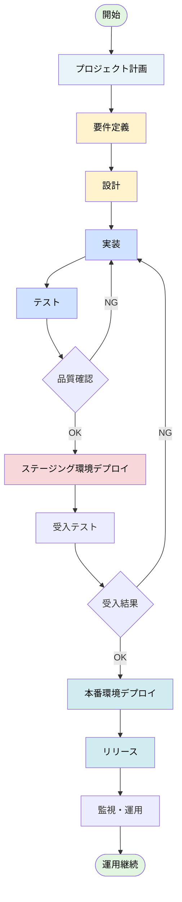
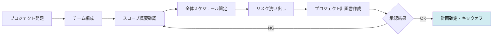
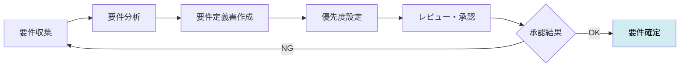
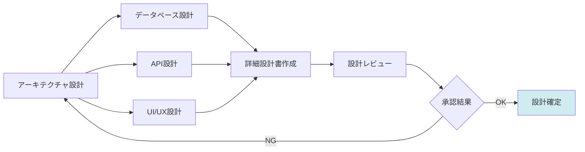
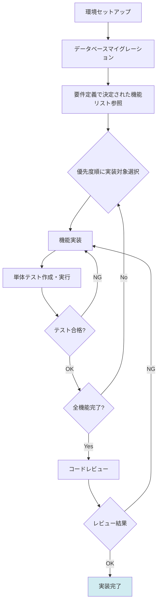
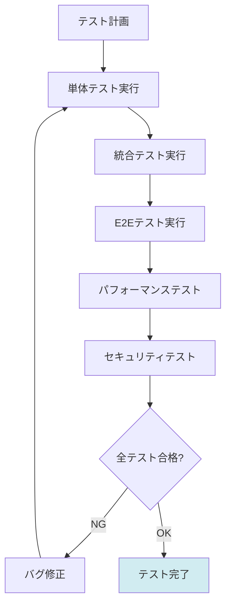
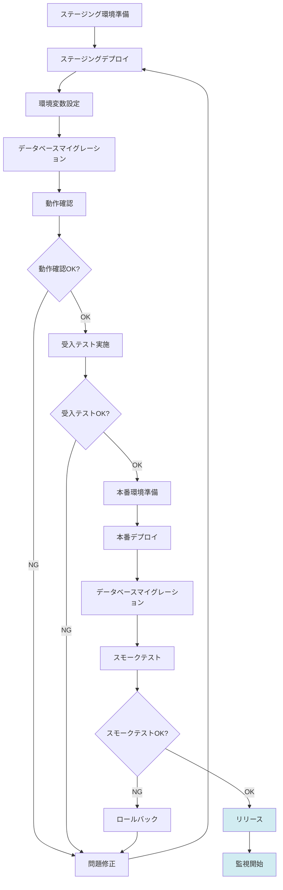
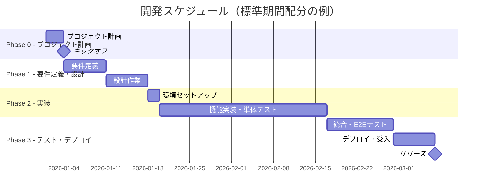
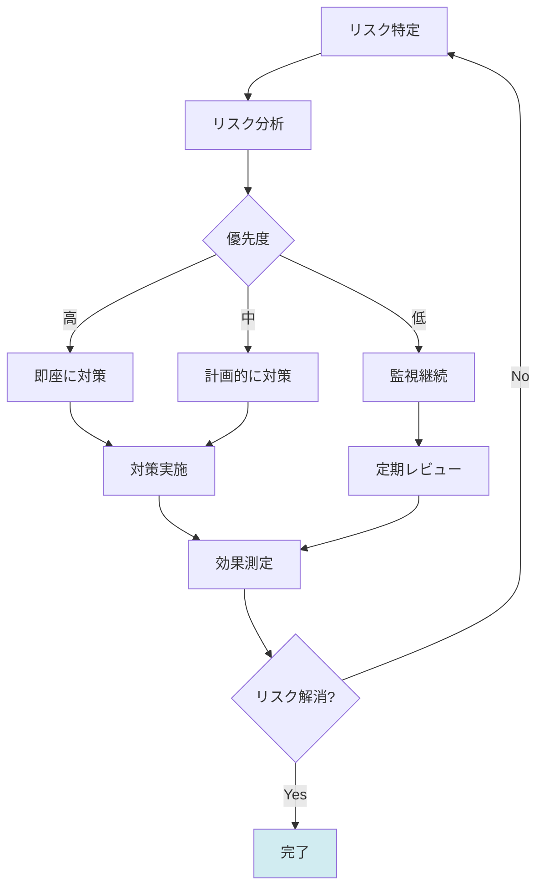
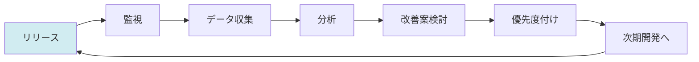

# 標準開発プロセス - プロジェクト計画からリリースまで

## 1. 開発フロー全体像

## 2. フェーズ別詳細フロー

### 2.0 プロジェクト計画フェーズ

**成果物：**
- プロジェクト計画書（[テンプレート](project-planning-template.md)）
- チーム体制図
- 全体スケジュール（マイルストーン）
- リスク管理表

**このフェーズで決定すべき事項：**
- **チーム体制と責任者**: 役割分担、稼働率、コミュニケーション計画
- **全体スケジュール**: プロジェクト期間の概算、マイルストーン設定
- **リスク管理**: 想定リスク、制約条件の特定

**詳細**: [プロジェクト計画テンプレート](project-planning-template.md)を参照してください。

### 2.1 要件定義フェーズ

**成果物：**
- 要件定義書
- 機能要件一覧
- 非機能要件一覧

**このフェーズで決定すべき事項：**
- **技術スタック**: 言語、フレームワーク、ツール（技術要件として）
- **品質基準**: テストカバレッジ目標、性能基準（非機能要件として）
- **詳細スケジュール**: WBS（Work Breakdown Structure）の作成
- **成果物リスト**: プロジェクトで必要なドキュメント種類

### 2.2 設計フェーズ

**成果物：**
- アーキテクチャ設計書
- データベース設計書
- API設計書
- 各機能の詳細仕様書（要件定義で決定された機能ごとに作成）

**このフェーズで決定すべき事項：**
- **コーディング規約**: スタイルガイド、命名規則
- **静的解析ルール**: リンター設定、型チェックルール

### 2.3 実装フェーズ

**成果物：**
- 実装コード（要件定義で決定された技術スタック）
- 単体テストコード
- UI/UXコンポーネント

### 2.4 テストフェーズ

**テスト項目：**
- 単体テスト: ビジネスロジック、バリデーション、権限チェック
- 統合テスト: API、データベース連携
- E2Eテスト: 要件定義で定義された主要ユーザーフロー
- パフォーマンステスト: 非機能要件で定義された性能基準
- セキュリティテスト: 非機能要件で定義されたセキュリティ要件

### 2.5 デプロイ・リリースフェーズ

**チェックリスト：**
- [OK] 環境変数が正しく設定されている
- [OK] データベース接続が確立できる
- [OK] 外部サービス連携が機能する
- [OK] 要件定義で定義された主要機能が動作する
- [OK] 非機能要件（パフォーマンス等）を満たす
- [OK] エラー監視・ログ収集が設定されている

## 3. タイムライン（ガントチャート）

**注記：** 上記は標準的な期間配分の一例です（総期間：約8週間）。実際のスケジュールはプロジェクト規模と要件に応じて調整してください。

## 4. 各フェーズの責任者と成果物

| フェーズ | 責任者 | 期間 | 主な成果物 | 完了条件 |
|---------|-------|------|-----------|---------|
| プロジェクト計画 | PO/PM | 3日 | プロジェクト計画書、チーム体制図 | チーム編成、全体スケジュール、リスク管理表が整備されている |
| 要件定義 | PO | 1週間 | 要件定義書 | 要件が明確化され、優先度が決定されている |
| 設計 | 開発者 | 1週間 | 各種設計書・仕様書 | 設計レビューが完了し、実装可能な状態 |
| 実装 | 開発者 | 4週間 | コード、単体テスト、UI | 全ての要件機能が実装され、単体テストが完了 |
| テスト | 開発者 | 1.5週間 | テストコード、テスト報告 | 全テストが合格 |
| デプロイ | 開発者 | 1週間 | デプロイ手順書、監視設定 | 本番環境で安定稼働 |

## 5. 品質ゲート

各フェーズ完了時に以下のチェックを実施：

### プロジェクト計画完了ゲート
- [OK] プロジェクト目的と背景が明確になっている
- [OK] チーム体制と責任者が決定されている
- [OK] 全体スケジュールとマイルストーンが策定されている
- [OK] 主要リスクが特定され、対策方針が決定されている
- [OK] ステークホルダーの承認を得ている（キックオフ準備完了）

### 要件定義完了ゲート
- [OK] 機能要件が明確に定義されている
- [OK] 非機能要件が明確に定義されている
- [OK] スコープが明確（in/out of scope）
- [OK] 優先度が設定されている
- [OK] ステークホルダーの承認を得ている

### 設計完了ゲート
- [OK] アーキテクチャが要件を満たす
- [OK] データモデルが適切に設計されている
- [OK] API設計が採用した設計原則に従う
- [OK] UI/UX設計がユーザビリティ原則に従う
- [OK] セキュリティ要件が設計に組み込まれている

### 実装完了ゲート
- [OK] コードレビューが完了している
- [OK] 単体テストが書かれている
- [OK] テストカバレッジがプロジェクトで定義された基準を満たす
- [OK] 静的解析ツールのエラーがない
- [OK] 型チェック（使用する言語に応じて）に合格している

### テスト完了ゲート
- [OK] 全ての単体テストが合格
- [OK] 全ての統合テストが合格
- [OK] 主要フローのE2Eテストが合格
- [OK] パフォーマンス要件を満たす
- [OK] セキュリティ脆弱性がない

### リリース完了ゲート
- [OK] ステージング環境で受入テスト完了
- [OK] 本番環境で動作確認完了
- [OK] ロールバック手順が確認済み
- [OK] 監視・アラート設定完了
- [OK] ドキュメントが整備されている

## 6. リスク管理フロー

## 7. 継続的改善サイクル

**監視項目：**
- パフォーマンス（レスポンスタイム、エラー率）
- ユーザー行動（利用機能、離脱ポイント）
- システムリソース（CPU、メモリ、DB接続）
- ビジネスメトリクス（ユーザー数、アクティブ率）

---

**関連ドキュメント**: [開発プロセス概要](process-overview.md) | [プロジェクト計画テンプレート](project-planning-template.md)
