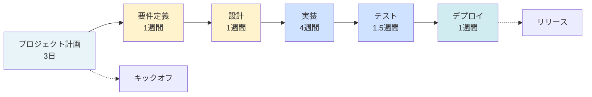
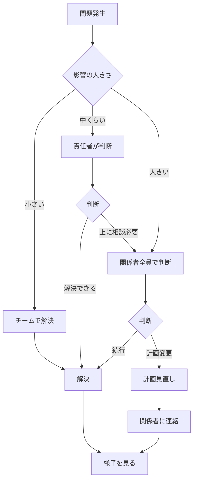

# 開発プロセス概要

> **この1ページでわかること**: プロジェクト全体の流れ

## プロセス全体像（約8週間）

## フェーズ別サマリー

| フェーズ | 期間 | 作るもの | 完了の条件 | 責任者 |
|---------|------|---------|-----------|--------|
| **計画** | 3日 | プロジェクト計画書、チーム編成表 | チーム、スケジュール、リスクが決まっている | プロジェクトリーダー |
| **要件定義** | 1週間 | 要件定義書（何を作るか） | 使う技術・品質基準が決まり、承認された | プロジェクトリーダー |
| **設計** | 1週間 | 設計書、API仕様、DB設計 | 設計をレビューし、実装できる状態 | 開発チーム |
| **実装** | 4週間 | プログラム、テスト | 全機能が完成、テストが通っている | 開発チーム |
| **テスト** | 1.5週間 | テスト結果報告 | すべてのテストに合格している | 開発チーム |
| **デプロイ** | 1週間 | 本番環境、監視システム | 実際に使えることを確認済み | 開発チーム |

## 重要マイルストーン

| # | マイルストーン | タイミング | チェックポイント |
|---|--------------|-----------|----------------|
| 1 | **キックオフ** | 3日目 | 関係者全員の認識統一 |
| 2 | **要件確定** | 2週目 | やることを確定、変更ルール開始 |
| 3 | **設計承認** | 3週目 | システム構造・技術の最終決定 |
| 4 | **実装完了** | 7週目 | プログラム変更停止、テスト開始 |
| 5 | **受入完了** | 8週目 | 関係者承認、リリース判定 |
| 6 | **リリース** | 8.5週目 | 本番公開、監視開始 |

## よくある問題と対策

| 問題 | 影響 | 起きやすさ | 対策 |
|------|------|----------|------|
| やることがどんどん増える | 大 | 中 | 要件が決まったら変更ルールを決める |
| 技術的な問題に遅く気づく | 大 | 中 | 設計のときに試作して確認する |
| 人が足りない | 中 | 中 | 予備期間を確保、必要なら外部協力 |
| 関係者との認識のズレ | 中 | 高 | 毎週デモして意見をもらう |
| テスト時間が足りなくなる | 大 | 中 | 実装中からテストを続ける |

## 次の段階に進んでいいか判断する基準

各フェーズが終わったら、以下を確認して次に進んでいいか判断：

| フェーズ | 進んでいい条件 |
|---------|-------------|
| 計画 | 関係者全員が承認、リスク対策が決まっている |
| 要件定義 | 何を作るかが明確、使う技術が決定、承認された |
| 設計 | 設計が要件を満たす、レビューが完了している |
| 実装 | 全機能が完成、テストが通る、プログラムレビュー完了 |
| テスト | 全テストに合格、性能・セキュリティ基準クリア |
| リリース | 使えることを確認、問題時の戻し方を確認済み |

**進めない場合**: 問題を見つける → 対策を考える → やり直す → 再確認（スケジュールへの影響を評価）

## 問題が起きたときの報告ルール

**報告の基準**:
- **小さい**: 1日以内に解決、スケジュールに影響なし
- **中くらい**: 2-3日遅れる、一部の機能に影響
- **大きい**: 1週間以上遅れる、予算・計画の大幅変更が必要

## 定例会議

| 会議 | 頻度 | 参加者 | 目的 |
|------|------|--------|------|
| キックオフ | 開始時1回 | 全員 | プロジェクトの目的・体制・スケジュール共有 |
| 週次進捗会議 | 毎週 | プロジェクトリーダー、チームリーダー | 進み具合確認、問題共有、判断 |
| 朝会 | 毎日 | 開発チーム | 今日やること、困っていることを共有 |
| フェーズレビュー | フェーズ終了時 | 関係者全員 | 次に進んでいいか判断、承認 |
| デモ | 2週間に1回 | プロジェクトリーダー、関係者 | 作ったものを見せて意見をもらう |

## 成功させるためのポイント

1. **最初に何を作るか明確にする**: 途中で変えるときはちゃんと管理する
2. **各段階で確認してから次に進む**: 焦らず、完了条件を満たしてから
3. **問題を早く見つける**: 設計のときに試作する、テストを続ける
4. **情報を隠さない**: 問題はすぐ共有、早く判断する
5. **余裕を持つ**: 予想外のことに対応できるよう、予備時間を確保（全体の10-15%）

---

**関連ドキュメント**: [標準開発プロセス完全版](standard-development-process.md) | [プロジェクト計画テンプレート](project-planning-template.md)
